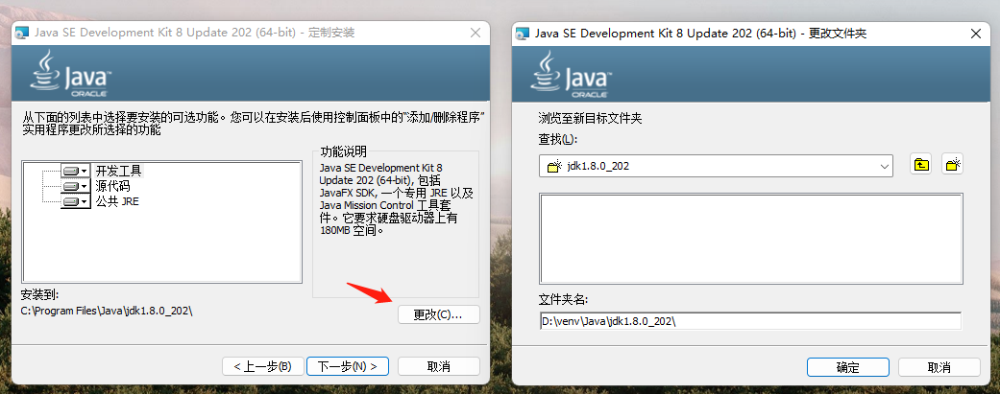

# 前期准备

## 开发环境

本页总结了设置和开始开发PySpark ETL项目所需的基本步骤，前提已经安装完成[Python开发前准备](/pythonic-project-guidelines/introduction/install)。

使用[Pypi](https://pypi.org/project/pyspark/)
安装[PySpark](https://spark.apache.org/docs/latest/api/python/getting_started/index.html)如下：

```shell
pip install pyspark
```

使用[Pipenv](/pythonic-project-guidelines/quick_start/#13)安装PySpark如下：

```shell
pipenv install pyspark
```

## Windows系统环境

本地运行PySpark项目时环境依赖[Hadoop](https://archive.apache.org/dist/hadoop/common/)
和[JDK](https://www.oracle.com/java/technologies/downloads/#java8)，需要安装并配置环境变量

!!! info "环境变量路径问题"

     如JAVA_HOME，HADOOP_HOME环境变量，路径中不要带有空格或中文，避免加载时报错

### 安装Hadoop

下载[Hadoop二进制包](https://archive.apache.org/dist/hadoop/common/)

建议使用解压工具对`.tar.gz`文件格式进行解压，如[Bandizip](https://cn.bandisoft.com/bandizip/dl/)

在Windows PowerShell 运行`tar -zxvf`中可能发生[Maximum Path Length Limitation](https://docs.microsoft.com/en-us/windows/win32/fileio/maximum-file-path-limitation?tabs=registry)

### 安装JDK

下载[JDK安装包](https://www.oracle.com/java/technologies/downloads/#java8)，建议统一管理开发环境，更改安装路径。

[](../../assets/images/pycharm/windows_install_jdk.png)

### 配置环境变量

配置`JAVA_HOME`

[](../../assets/images/pycharm/windows_env_java.png)

配置`HADOOP_HOME`

[](../../assets/images/pycharm/windows_env_hadoop.png)

配置`%JAVA_HOME%/bin`，`%HADOOP_HOME%/bin`

[](../../assets/images/pycharm/windows_env_path.png)


## MacOs系统环境

TODO

## 常见问题总结：

### 问题1 （缺少`winutils.exe`, `hadoop.dll`）：

```shell
22/08/25 13:51:47 tid: [main] WARN  org.apache.hadoop.util.Shell - 
Did not find winutils.exe: {}
java.io.FileNotFoundException: java.io.FileNotFoundException: HADOOP_HOME and hadoop.home.dir are unset. -see https://wiki.apache.org/hadoop/WindowsProblems
    at org.apache.hadoop.util.Shell.fileNotFoundException(Shell.java:548)
    at org.apache.hadoop.util.Shell.getHadoopHomeDir(Shell.java:569)
    at org.apache.hadoop.util.Shell.getQualifiedBin(Shell.java:592)
    at org.apache.hadoop.util.Shell.<clinit>(Shell.java:689)
    at org.apache.hadoop.util.StringUtils.<clinit>(StringUtils.java:78)
    at org.apache.hadoop.fs.FileSystem$Cache$Key.<init>(FileSystem.java:3609)
    at org.apache.hadoop.fs.FileSystem$Cache$Key.<init>(FileSystem.java:3604)
    at org.apache.hadoop.fs.FileSystem$Cache.get(FileSystem.java:3441)
    at org.apache.hadoop.fs.FileSystem.get(FileSystem.java:524)
    at org.puppy.hadoop.app.HDFSApplication.main(HDFSApplication.java:26)
Caused by: java.io.FileNotFoundException: HADOOP_HOME and hadoop.home.dir are unset.
    at org.apache.hadoop.util.Shell.checkHadoopHomeInner(Shell.java:468)
    at org.apache.hadoop.util.Shell.checkHadoopHome(Shell.java:439)
    at org.apache.hadoop.util.Shell.<clinit>(Shell.java:516)
    ... 6 common frames omitted
```

__解决方案:__

Windows在安装Hadoop环境时可能会遇到缺少文件`winutils.exe`和`hadoop.dll`，可以通过[github下载Hadoop文件](https://github.com/cdarlint/winutils)
，将安装时缺少的文件，放入%Hadoop%/bin目录下，重启IDE。

> （如果还不成功的话可以尝试）将hadoop.dll复制到C:\Window\System32下

### 问题2 （Python worker failed to connect back.）：

```
22/08/25 13:51:47 ERROR Executor: Exception in task 0.0 in stage 2.0 (TID 2)
org.apache.spark.SparkException: Python worker failed to connect back.
	at org.apache.spark.api.python.PythonWorkerFactory.createSimpleWorker(PythonWorkerFactory.scala:189)
	at org.apache.spark.api.python.PythonWorkerFactory.create(PythonWorkerFactory.scala:109)
	at org.apache.spark.SparkEnv.createPythonWorker(SparkEnv.scala:124)
	at org.apache.spark.api.python.BasePythonRunner.compute(PythonRunner.scala:164)
	at org.apache.spark.sql.execution.python.BatchEvalPythonExec.evaluate(BatchEvalPythonExec.scala:81)
	at org.apache.spark.sql.execution.python.EvalPythonExec.$anonfun$doExecute$2(EvalPythonExec.scala:130)
	at org.apache.spark.rdd.RDD.$anonfun$mapPartitions$2(RDD.scala:855)
	at org.apache.spark.rdd.RDD.$anonfun$mapPartitions$2$adapted(RDD.scala:855)
	at org.apache.spark.rdd.MapPartitionsRDD.compute(MapPartitionsRDD.scala:52)
	at org.apache.spark.rdd.RDD.computeOrReadCheckpoint(RDD.scala:365)
	at org.apache.spark.rdd.RDD.iterator(RDD.scala:329)
	at org.apache.spark.rdd.MapPartitionsRDD.compute(MapPartitionsRDD.scala:52)
	at org.apache.spark.rdd.RDD.computeOrReadCheckpoint(RDD.scala:365)
	at org.apache.spark.rdd.RDD.iterator(RDD.scala:329)
	at org.apache.spark.rdd.MapPartitionsRDD.compute(MapPartitionsRDD.scala:52)
	at org.apache.spark.rdd.RDD.computeOrReadCheckpoint(RDD.scala:365)
	at org.apache.spark.rdd.RDD.iterator(RDD.scala:329)
	at org.apache.spark.scheduler.ResultTask.runTask(ResultTask.scala:90)
	at org.apache.spark.scheduler.Task.run(Task.scala:136)
	at org.apache.spark.executor.Executor$TaskRunner.$anonfun$run$3(Executor.scala:548)
	at org.apache.spark.util.Utils$.tryWithSafeFinally(Utils.scala:1504)
	at org.apache.spark.executor.Executor$TaskRunner.run(Executor.scala:551)
	at java.util.concurrent.ThreadPoolExecutor.runWorker(ThreadPoolExecutor.java:1149)
	at java.util.concurrent.ThreadPoolExecutor$Worker.run(ThreadPoolExecutor.java:624)
	at java.lang.Thread.run(Thread.java:748)
Caused by: java.net.SocketTimeoutException: Accept timed out
	at java.net.DualStackPlainSocketImpl.waitForNewConnection(Native Method)
	at java.net.DualStackPlainSocketImpl.socketAccept(DualStackPlainSocketImpl.java:135)
	at java.net.AbstractPlainSocketImpl.accept(AbstractPlainSocketImpl.java:409)
	at java.net.PlainSocketImpl.accept(PlainSocketImpl.java:199)
	at java.net.ServerSocket.implAccept(ServerSocket.java:545)
	at java.net.ServerSocket.accept(ServerSocket.java:513)
	at org.apache.spark.api.python.PythonWorkerFactory.createSimpleWorker(PythonWorkerFactory.scala:176)
	... 24 more
```

__解决方案:__

全局增加环境变量或IDE增加环境变量，增加内容如下：

```shell
PYSPARK_DRIVER_PYTHON=jupyter;
PYSPARK_PYTHON=python
```
