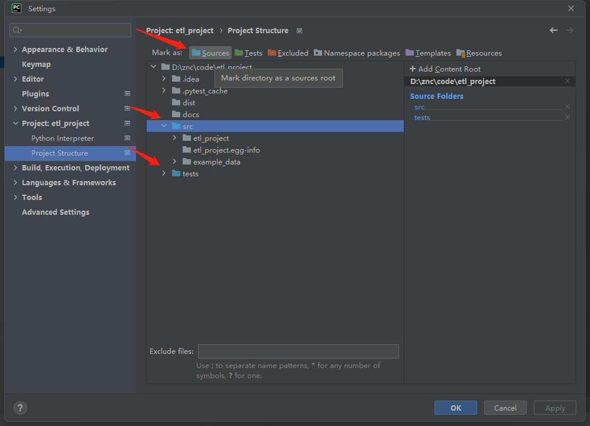

# 快速上手

本文通过一个包含主要知识点的简单项目，向开发者展示一个通用、规范和易于理解的Pyspark ETL的项目开发流程。
示例项目是一个将本地文件进行预处理，并将结果导出文件的演示程序。

## 初始化项目

### 克隆项目模板

[//]: # ( TODO [cookiecutter]&#40;https://cookiecutter.readthedocs.io/en/1.7.2/README.html&#41; 是一个通过项目模板创建项目的命令行工具。)

使用[Git](https://git-scm.com/)克隆项目模板

```bash
git clone https://github.com/JingyuanR/pyspark-etl-template.git
```

### 创建虚拟环境

切换到`pyspark-etl-template`
文件路径下，项目使用 [poetry](/pythonic-project-guidelines/introduction/virtualenv/#25-poetry)
管理虚拟环境，运行命令自动创建虚拟环境，同时安装开发环境依赖

```bash
poetry install
```

### IDE项目初始化

#### 加载虚拟环境

使用Pycharm打开项目 `File` | `Settings` | `Project` | `Python Interpreter`

选择 `Poetry Environment`

添加刚才创建的虚拟环境(选择`Existing`)

[](../../assets/images/pycharm/pycharm_add_interpreter-1.png)

[](../../assets/images/pycharm/pycharm_add_interpreter-2.png)

#### 修改项目结构

使用Pycharm打开项目  `File` | `Settings` | `Project` | `Project Structure`

将`src`和`tests`目录设置为`Sources`源代码路径

[](../../assets/images/pycharm/add_project_structure.png)

#### ETL任务开发

ETL任务放在`Tasks`目录下，实现`AbstractTransform`和`AbstractTask`

- `AbstractTask`: Task任务抽象类，`executor`执行器实例化`插件Task`，执行`AbstractTask`抽象父类的`run`方法
    - `run`: 执行Task任务流程
    - `_input`: 数据源抽取(抽象方法)
    - `_transform`: 数据转换(抽象方法)，执行转换流程，调用`AbstractTransform`子类
    - `_output`: 数据加载(抽象方法)
- `AbstractTransform`: Transform抽象类，提供`AbstractTask`中`_transform`使用，同一个Task可以实现多个`_transform`
    - `_transform`: 数据转换(抽象方法)，指定转换流程，处理输入数据(DataFrame)

ETL任务完成后需要注册插件：

若使用[poetry](/pythonic-project-guidelines/introduction/virtualenv/#25-poetry)，`pyproject.toml`文件增加：

```toml
[tool.poetry.plugins."poetry.plugin"]
demo = "poetry_demo_plugin.plugin:MyPlugin"
```

开发环境需要初始化插件：

```
poetry plugin
```

## 开发实践

### 任务需求

现有汽车信息数据[car_price.csv](../../assets/data/car_price.csv)

- 对`CarName`字段包含`[dirty data]`数据进行纠正，去除字符串`[dirty data]`

- 删除`price`小于`10000`的汽车数据

- 最终结果Schema："car_id", "symboling", "car_name", "price", 将结果导出`json`文件

### Task类

创建ETL任务目录

`src/etl_project/tasks/car_etl_example`

创建汽车数据ETL任务**Task**类

`src/etl_project/tasks/car_etl_example/task.py`

```py title="task.py"
from pyspark.sql import DataFrame
from etl_project.tasks.abstract.task import AbstractTask
from etl_project.tasks.car_etl_example.car_transform import CarTransform


class CarDataTask(AbstractTask):
    """
    Processing car data task.
    """

    input_path = 'example_data/input'
    output_path = 'example_data/output'

    def _input(self) -> DataFrame:
        df: DataFrame = self.spark.read.csv(self.input_path, encoding='utf-8', header=True, inferSchema=True)
        self.logger.warn(f'Extract data from {self.input_path}')
        return df

    def _transform(self, df: DataFrame) -> DataFrame:
        return CarTransform().transform(df)

    def _output(self, df: DataFrame) -> None:
        df.write.json(self.output_path, mode='overwrite', encoding='utf-8')
        self.logger.warn(f'Load data to {self.output_path}')
```

每一个`Task`任务都会经理“输入”、“转换”和“输出”的过程，实现AbstractTask中的`_input`、`_transform`、`_output`抽象方法

- `_input`：读取`example_data/input`下csv文件
- `_transform`：执行将实现的`Transform`类的`transform`方法
- `_output`：将DataFrame以Json格式写入`example_data/output`目录下

### Transform类

创建汽车数据**Transform**类

`src/etl_project/tasks/car_etl_example/car_transform.py`

```py title="car_transform.py"
from functools import reduce
from pyspark.sql import DataFrame
from pyspark.sql.functions import udf, col
from pyspark.sql.types import StringType
from etl_project.tasks.abstract.transform import AbstractTransform


class CarTransform(AbstractTransform):
    """
    Car data Transformation.
    """

    def transform(self, df: DataFrame) -> DataFrame:
        transformations = (
            self._filter_price,
            self._process_car_name,
            self._select_final_columns,
        )
        return reduce(DataFrame.transform, transformations, df)  # type: ignore

    @staticmethod
    def _filter_price(df: DataFrame) -> DataFrame:
        return df.filter(col('price') > 10000)

    @staticmethod
    def _process_car_name(df: DataFrame) -> DataFrame:
        res_df = df.withColumn('CarName', _name_replace_udf(col('CarName')).alias('CarName'))
        return res_df

    @staticmethod
    def _select_final_columns(df: DataFrame) -> DataFrame:
        return df.select(
            col('car_ID').alias('car_id'),
            col('symboling'),
            col('CarName').alias('car_name'),
            col('price'),
        )


@udf(returnType=StringType())
def _name_replace_udf(car_name):
    if not car_name:
        return
    err_str = '[dirty data]'
    if err_str not in car_name:
        return car_name
    car_name = car_name.replace(err_str, '')
    return car_name
```

实现汽车数据Transform类，实现抽象函数`transform`，实现数据清洗流程：

1. 筛选 `price` > 10000 的数据
2. 将`CarName`包含脏数据"`[dirty_data]`"的内容，通过udf进行去除
3. 查询`car_id`， `symboling`， `car_name`， `price`数据
4. 返回数据结果，至此完成汽车数据转换过程

### 注册Task

将上述实现的类注册到命名空间中。

编辑`pyproject.toml`文件，增加[poetry插件](https://python-poetry.org/docs/plugins/)如下内容：

```toml
[tool.poetry.plugins."etl_tasks"]
car_etl_example = "pyspark_etl_template.tasks.car_etl_example.car_transform:CarTransform"
```

这么做的目的是将 `CarDataTask` 注册到 `entry_points` 中， 然后在程序中使用 `import.metadata`
根据名称空间查找。而 `stevedore` 则是封装了查找的复杂逻辑，让使用 更简单。

将项目以可编辑模式安装到当前环境：

```shell
poetry install
```

可以在 `Python Console` 下查看注册插件信息：

```bash
>>> from importlib.metadata import entry_points

>>> entry_points(group='etl_tasks')

[EntryPoint(name='car_etl_example', value='pyspark_etl_template.tasks.car_etl_example.car_transform:CarTransform', group='etl_tasks')]
```

### 运行Task

```bash
python src/etl_project/app.py --env=dev --task=car_etl_example
```

