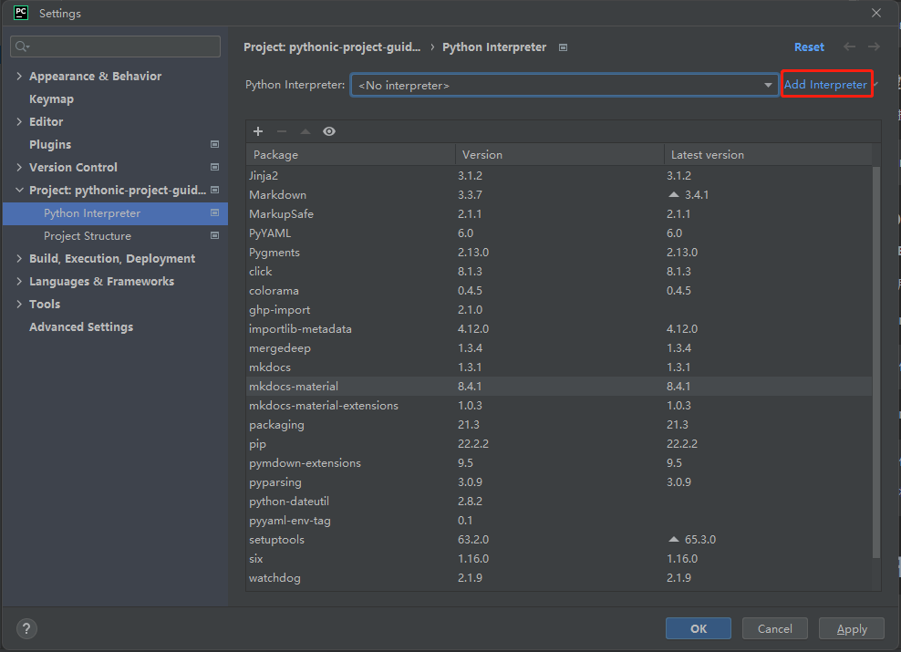
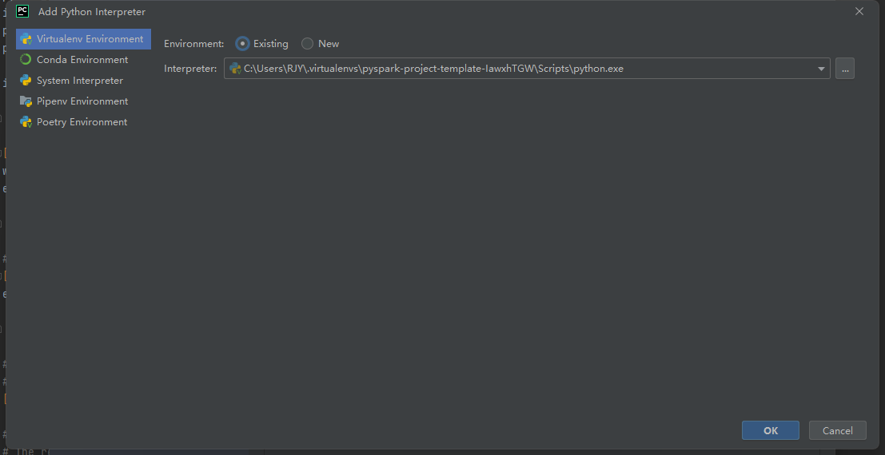
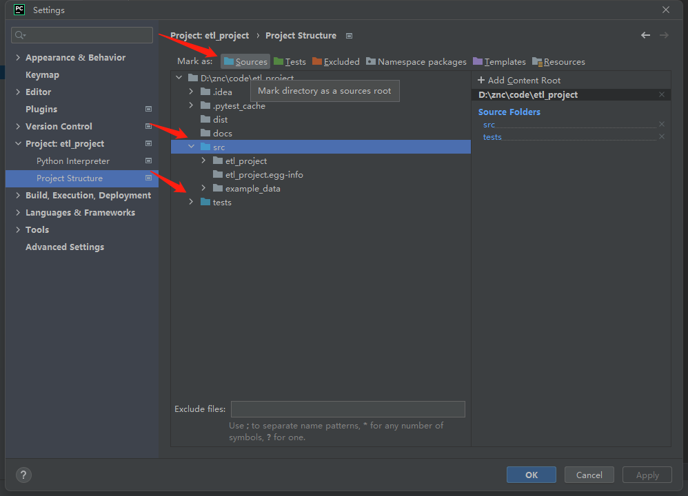

# 初始化项目

本文通过一个包含主要知识点的简单项目，向开发者展示一个通用、规范和易于理解的ETL的项目开发流程。
示例项目使用`Pyspark`将本地文件进行预处理，并将结果导出文件的演示程序。

## 创建项目骨架

使用 [cookiecutter](https://github.com/cookiecutter/cookiecutter) 加载项目模板。通过交互操作，可以选择使用的功能。

```bash
cookiecutter https://github.com/pyloong/cookiecutter-pythonic-project-bigdata-etl
```

## 创建虚拟环境

切换到项目根目录下，项目使用 [poetry](/pythonic-project-guidelines/introduction/virtualenv/#25-poetry)
管理虚拟环境，运行命令自动创建虚拟环境，同时安装开发环境依赖

```bash
poetry install
```

## IDE项目初始化

### 加载虚拟环境

使用Pycharm打开项目 `File` | `Settings` | `Project` | `Python Interpreter`

选择 `Poetry Environment`

添加刚才创建的虚拟环境(选择`Existing`)

[](../../assets/images/pycharm/pycharm_add_interpreter-1.png)

[](../../assets/images/pycharm/pycharm_add_interpreter-2.png)

### 修改项目结构

使用Pycharm打开项目  `File` | `Settings` | `Project` | `Project Structure`

将`src`和`tests`目录设置为`Sources`源代码路径

[](../../assets/images/pycharm/add_project_structure.png)

### ETL项目概述

在开发ETL任务的时候，建议在`tasks`目录下新建文件夹来存放对应ETL任务代码，这样做的好处是方便管理和阅读。

#### Executor

执行器`executor`，它只关心`AbstractTask`的`run`方法，开发者不需要重复开发调用`Task`相关的功能。

`_load_task`：通过[stevedore](/pythonic-project-guidelines/guidelines/advanced/plugin/#stevedore)
插件框架，查找在`namespace`中注册的`Task`，并进行实例化。

`run`：调用`AbstractTask`的`run`方法。

``` python
"""
Loads a Task class and calls its `run()` method.
"""
import logging
from typing import Callable

from stevedore import ExtensionManager

from etl_project.constants import TASK_NAMESPACE
from etl_project.context import Context
from etl_project.utils.exception import PluginNotFoundError


class Executor:
    """
    Loads a Task class and calls its `run()` method.
    """
    # pylint: disable=too-few-public-methods

    def __init__(self, ctx: Context, task: str):
        self.ctx = ctx
        self.task = task

    def run(self) -> None:
        """calls its `run()` method in the task class"""
        task_class = self._load_task(TASK_NAMESPACE, self.task)
        logging.info(f"Running task: {task_class}")
        task_class().run()

    @staticmethod
    def _load_task(namespace: str, name: str) -> Callable:
        """Get extension by name from namespace, return task obj"""
        extension_manager = ExtensionManager(namespace=namespace, invoke_on_load=False)
        for ext in extension_manager.extensions:
            if ext.name == name:
                return ext.plugin
            logging.warning(f'Load plugin: {ext.plugin} in namespace "{namespace}"')
        raise PluginNotFoundError(namespace=namespace, name=name)
```

#### AbstractTask

在开发时建议实现`AbstractTransform`和`AbstractTask`，这两个抽象类将任务的通用方法抽象提出，开发者只需要关心业务就可以了。

`AbstractTask`: Task任务抽象类，`executor`执行器实例化`Task`，执行`AbstractTask`抽象父类的`run`方法

- `run`: 执行Task任务流程
- `_extract`: 数据源抽取(抽象方法)
- `_transform`: 数据转换(抽象方法)，执行转换流程，调用`AbstractTransform`子类
- `_load`: 数据加载(抽象方法)

```python
"""Base Task"""
from abc import ABC, abstractmethod

from etl_project.context import Context


class AbstractTask(ABC):
    """
    Base class to read a dataset, transform it, and save it to a table.
    """

    # pylint: disable=[too-few-public-methods]

    def __init__(self):
        self.ctx = Context()
        self.settings = self.ctx.settings

    def run(self) -> None:
        """Execute task module"""
        data = self._extract()
        data_transformed = self._transform(data)
        self._load(data_transformed)

    @abstractmethod
    def _extract(self):
        """extract tmp from file/database/other."""
        raise NotImplementedError

    @abstractmethod
    def _transform(self, data):
        """Transform incoming tmp, and output the transform result"""
        raise NotImplementedError

    @abstractmethod
    def _load(self, data) -> None:
        """Load tmp to file/database/other."""
        raise NotImplementedError

```

#### AbstractTransform

`AbstractTransform`: Transform抽象类，提供`AbstractTask`中`_transform`进行调用，同一个Task可以实现多个`_transform`

- `_transform`: 数据转换(抽象方法)，指定转换流程，处理输入数据(`data`)

```python
"""Base Transform"""
from abc import ABC, abstractmethod

from etl_project.context import Context


class AbstractTransform(ABC):
    """
    Base class to define a DataFrame transformation.
    """

    # pylint: disable=[too-few-public-methods]

    def __init__(self):
        self.ctx = Context()
        self.settings = self.ctx.settings

    @abstractmethod
    def transform(self, data):
        """Transform original dataset."""
        raise NotImplementedError

```

#### Context

`context.py`负责整个项目的上下文内容管理，单例模式实现，开发者可以将公共的属性或方法在`Context`
中进行实现。这样可以避免对象的重复实例化，始终使用同一个`Context`并调用其中的属性和方法。

```python
"""Context"""
from dynaconf.base import Settings

from etl_project.constants import ENV_DEVELOPMENT
from etl_project.dependencies.config import config_manager
from etl_project.dependencies.logger import LoggerManager


@singleton
class Context:
    """
    Context for project, Provide properties and methods
    """
    environment = ENV_DEVELOPMENT

    def __init__(self):
        """Context Parameters"""
        self.settings = config_manager.from_env(self.environment)
        self.logger = LoggerManager(self.settings).get_logger()

```

`Context`所使用的`@singleton`单例模式装饰器实现如下：

```python
"""Singleton pattern decorator"""
_instance = {}


def singleton(cls):
    # 创建一个字典用来保存被装饰类的实例对象 _instance = {}
    def _singleton(*args, **kwargs):
        # 判断这个类有没有创建过对象，没有新创建一个，有则返回之前创建的
        if cls not in _instance:
            _instance[cls] = cls(*args, **kwargs)
        return _instance[cls]

    return _singleton

```

#### 注册插件

ETL任务完成后需要注册插件：

因为项目默认使用[poetry](/pythonic-project-guidelines/introduction/virtualenv/#25-poetry)
管理虚拟环境，则需要在`pyproject.toml` 文件增加中增加如下内容：

```toml
[tool.poetry.plugins."etl_tasks"]
task_name = "{task_class_path}:TaskExample"
```

使用如下命令将项目插件更新到环境中：

```shell
poetry install
```
