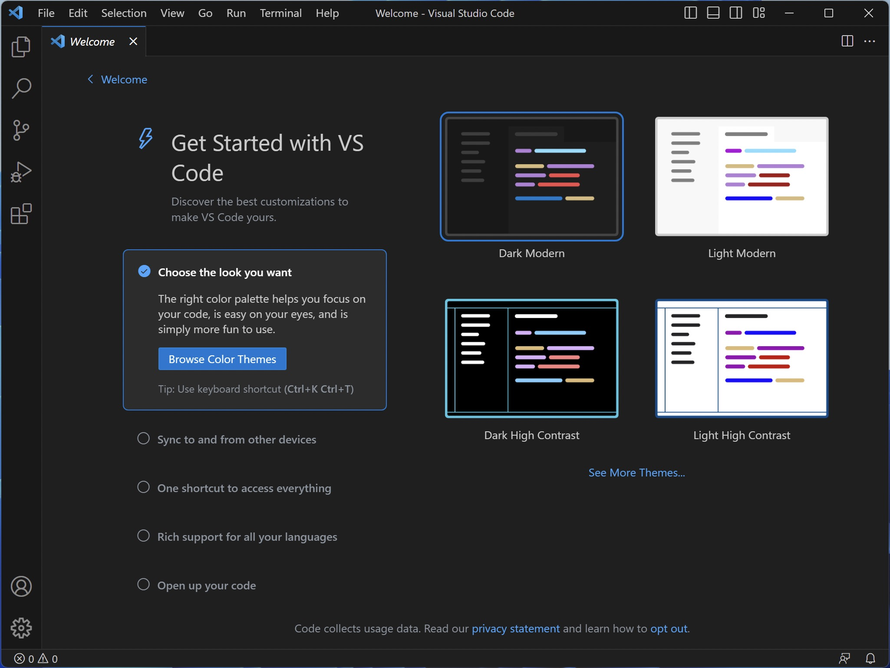
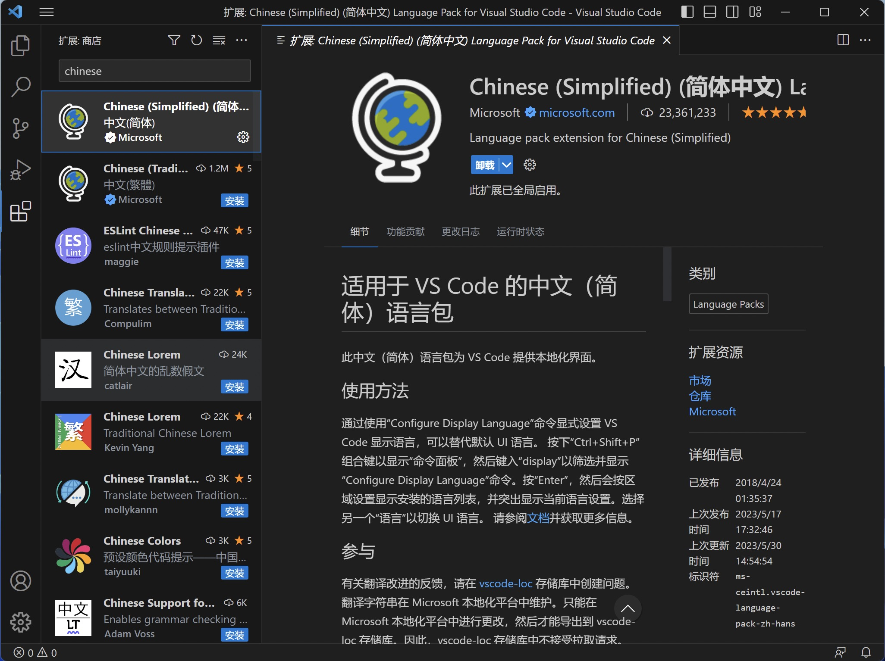
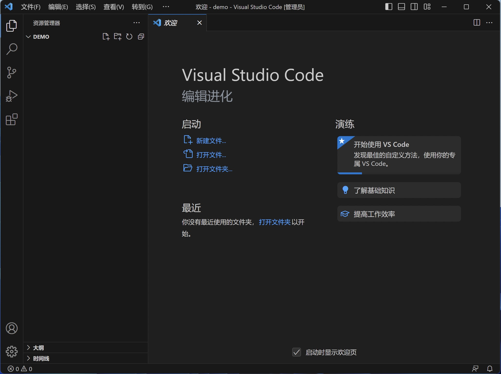
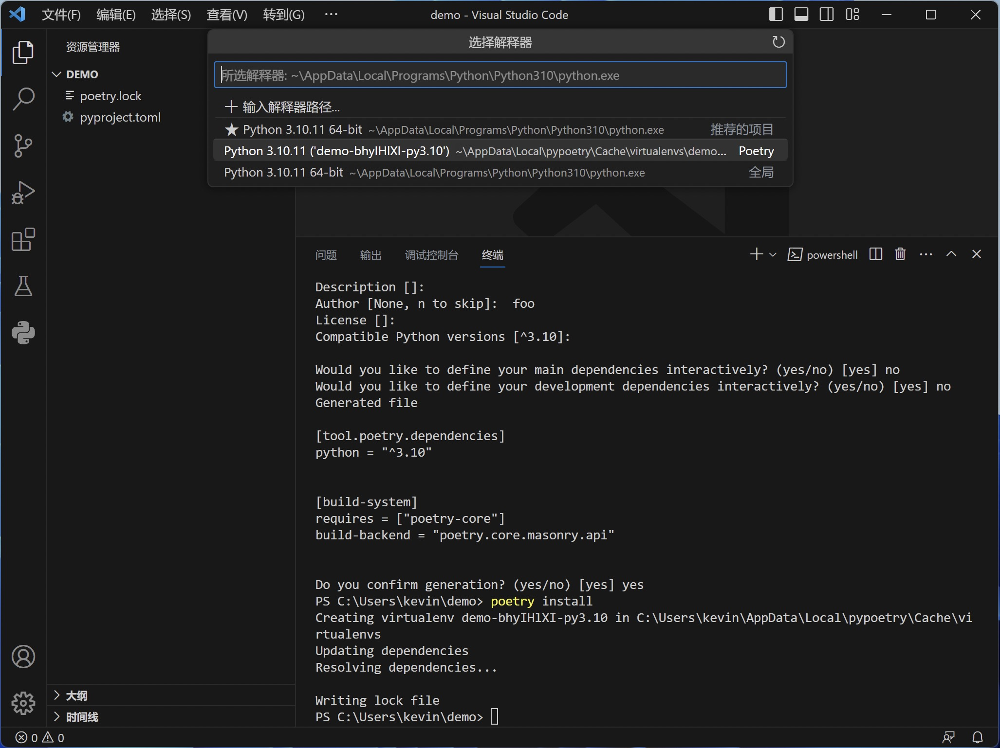

# Python 开发工具

能够做 Python 开发的工具有很多，甚至来说，如果你习惯比较好，都可以直接使用 VIM 或者 Windows 下的记事本
来编写 Python 代码。但是为了面向企业和工程化开发，推荐使用集成了诸多特性的开发工具，来改善开发体验。

当前主流的开发工具有：

- [Visual Studio Code](https://code.visualstudio.com/)
- [Pycharm](https://www.jetbrains.com/pycharm/)
- [Eclipse](https://www.eclipse.org/downloads/)

上述软件除了 [Pycharm](https://www.jetbrains.com/pycharm/) 专业版是收费的，其余都是免费。如果需要使用 [Pycharm](https://www.jetbrains.com/pycharm/)，
建议使用社区版，或者购买正版。

## Visual Studio Code

[VScode](https://code.visualstudio.com/) 是微软开发的一款文本编辑器，通过自带的插件系统，可以将文本编辑器打造成一个集成开发工具。

从官网下载并安装。




### 配置

从插件中心安装中文插件：



从插件中心安装 `Python Extension Pack` 插件：


### 使用

创建一个临时目录，然后选择使用 vscode 打开。Windows 可以通过右击，选择 `通过 Code 打开` ， Linux 可以在终端使用 `code demo` 命令打开。



然后使用快捷键 ``Ctrl + ` `` 组合键打开终端，执行 `poetry init` 根据提示操作，初始化 `pyproject.toml` 的配置文件，执行 `poetry shell`进行虚拟环境创建，执行 `poetry install`进行依赖安装：


然后使用 `Ctrl + Shift + p` 打开 vscode 的指令窗口，在窗口中输入 `>python: select Interpreter` 来选择项目需要使用的 Python 解释器，
然后选择上面一步创建的 Python 解释器：



然后可以看到窗口的左下角已经出现了上一步选择 Python 解释器。

创建新文件 `demo.py`，并输入如下代码：

```python
import sys


print(sys.version)

```


然后右击该文件，选择 `在终端中运行 Python 文件` ：


可以看到输入：


更多关于在 vscode 中使用 Python 的内容，请参考 [Getting Started with Python in VS Code](https://code.visualstudio.com/docs/python/python-tutorial) 。


## 问题排查

### vscode 终端无法自动启用 虚拟环境


#### 问题原因

由于 poetry 为终端(默认是 Powershell) 启动虚拟环境时，使用的 ps1 脚本文件，而 Powershell 默认的执行策略
是禁用脚本文件执行的。所以当 vscode 配置了虚拟环境后，启动终端，会无法执行脚本文件。

#### 解决方法

参考 [about_Execution_Policies](https:/go.microsoft.com/fwlink/?LinkID=135170) 的说明，并更改当前用户的 Powershell 执行策略：

```powershell
Set-ExecutionPolicy -ExecutionPolicy RemoteSigned -Scope CurrentUser
```

然后关闭终端窗口后再次打开即可。
